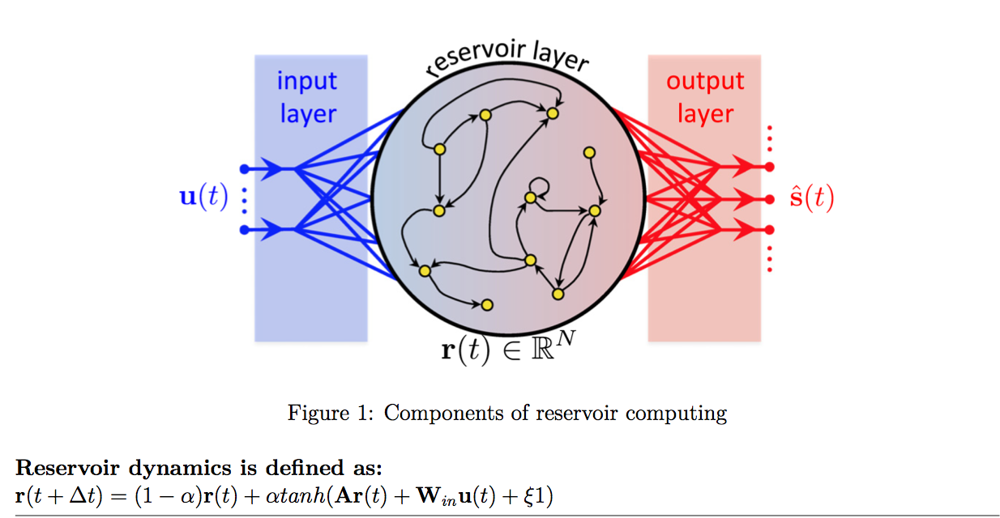
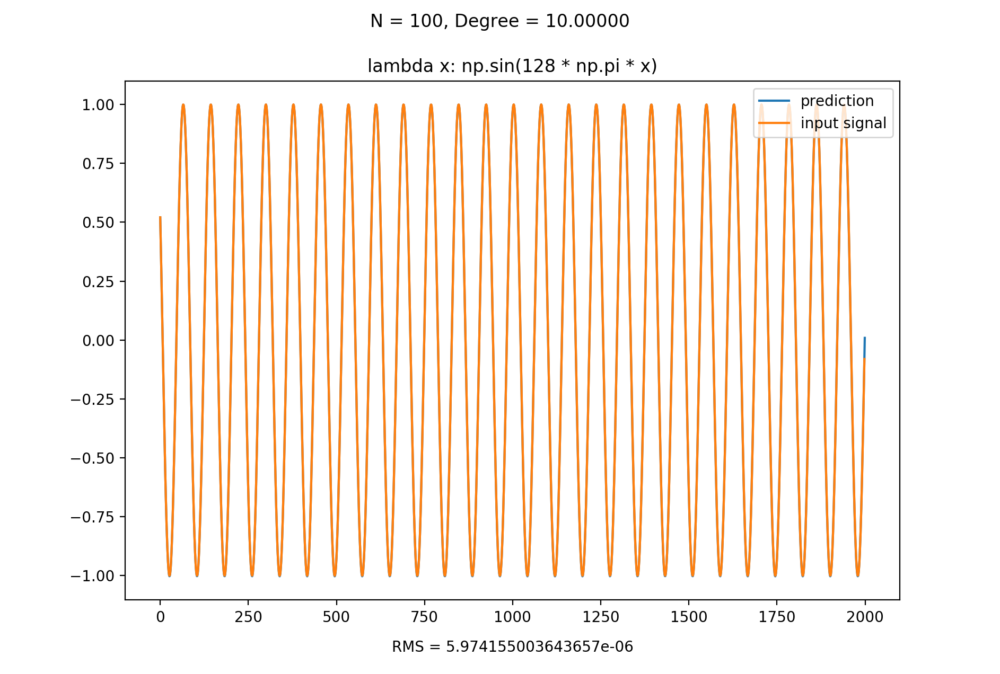
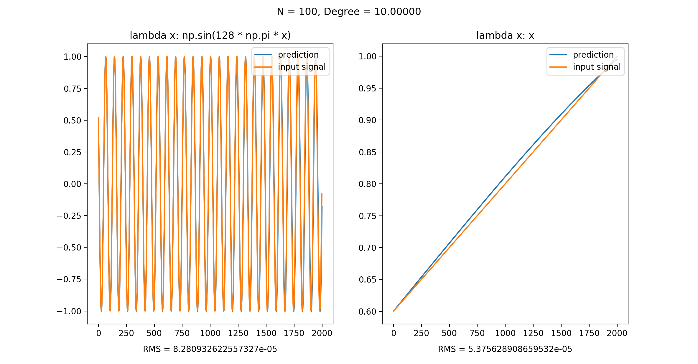
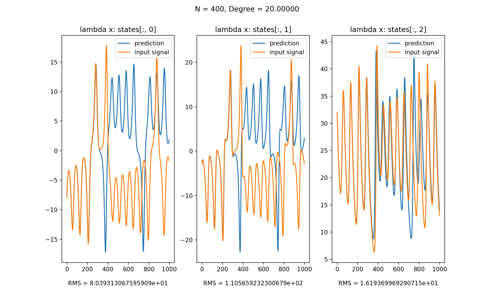
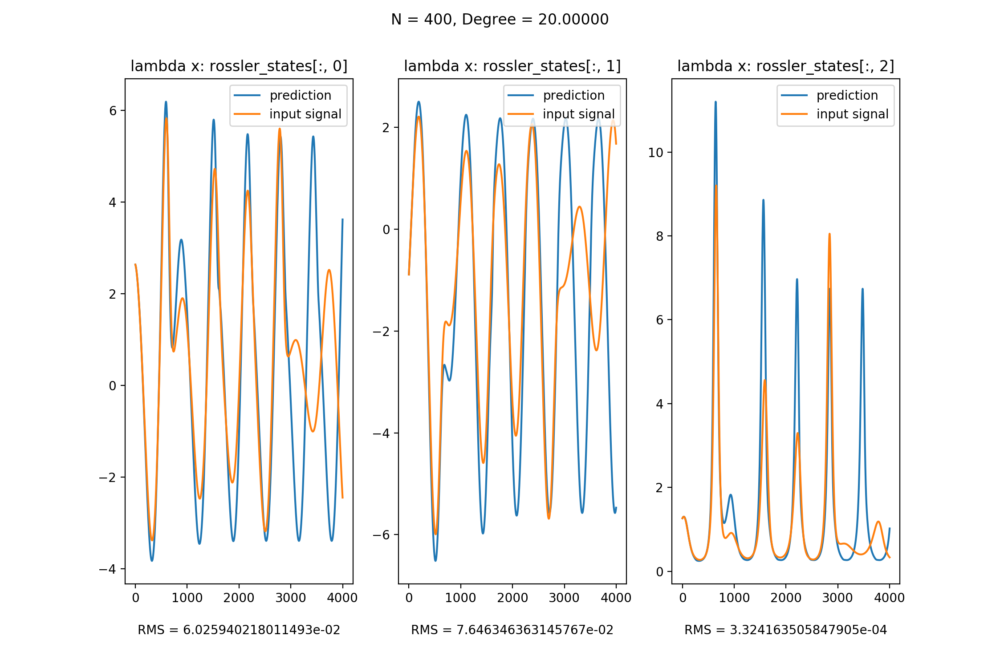
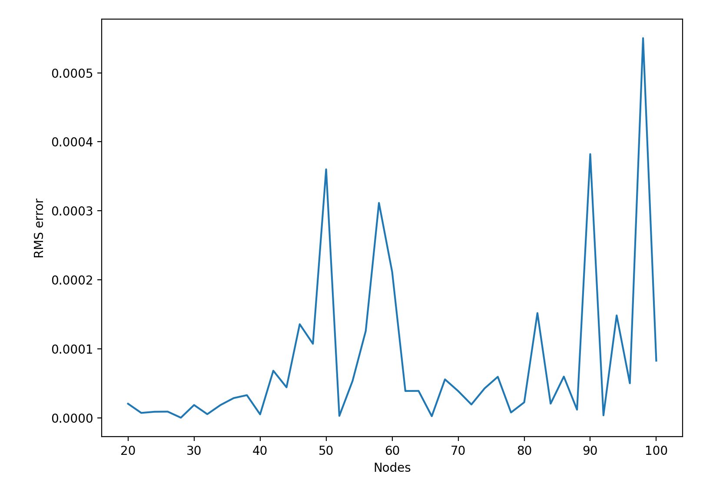
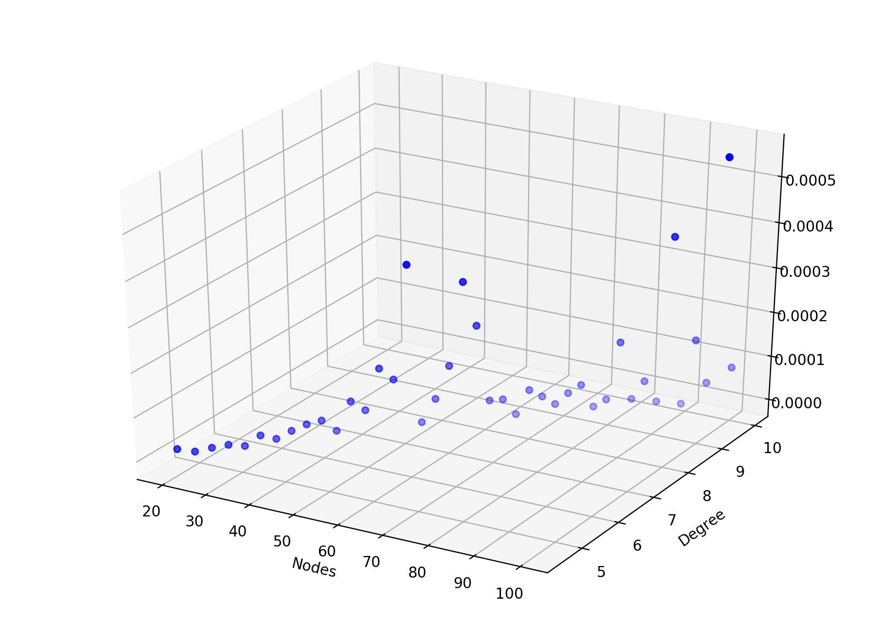

# Reservoir
Code for reservoir computing.



## Usage

The reservoir is constructed by the parameters defined in `reservoir.config`, which is:

```JSON
{
    "input": {
        "nodes": 2,
        "functions": [
            "lambda x: np.sin(128 * np.pi * x)",
            "lambda x: x"
        ],
        "length": 5000
    },
    "reservoir": {
        "start_node": 100,
        "end_node": 100,
        "step": 2,
        "degree_function": "lambda x: np.sqrt(x)",
        "sigma": 0.5,
        "bias": 1,
        "leakage_rate": 0.3,
        "regression_parameter": 1e-08
    },
    "output": {
        "nodes": 2
    },
    "training": {
        "init": 1000,
        "train": 3000,
        "test": 2000,
        "error": 1000
    }
}
```

It will generate the prediction.

For one single signal input:   
**sin(t):**   


For two signals input:     
**sin(t) and t:**    


For three singals input:   
**Lorenz System:**   


**Rössler System:**    



The result will be gathered in the file `reservoir.output`, you can visualize it by running `./visualize.py reservoir.output` or `./visualize3d.py reservoir.output`


