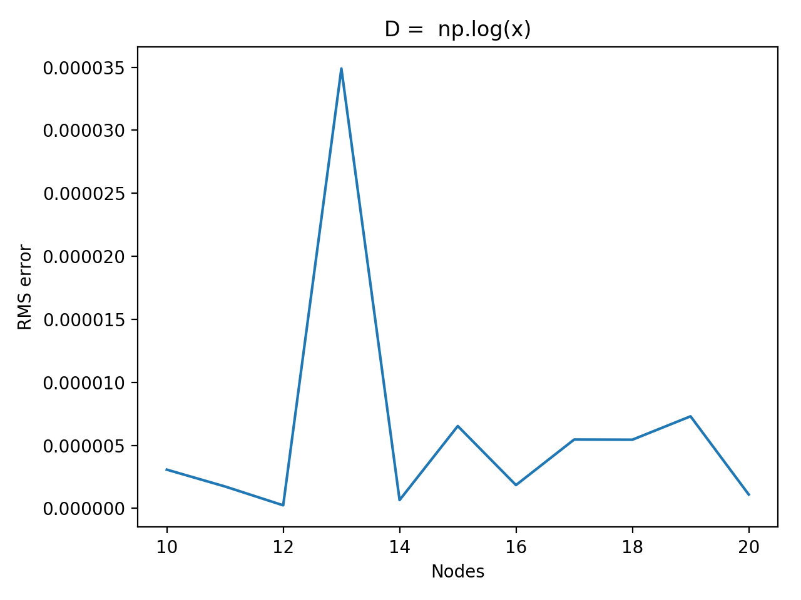

# Reservoir
Code for reservoir computing.


## Usage

The reservoir is constructed by the parameters defined in `reservoir.config`, which is:

```JSON
{
    "input": {
        "nodes": 1,
        "function": "lambda x: np.sin(128 * np.pi * x)",
        "length": 10000
    },
    "reservoir": {
        "start_node": 30,
        "end_node": 30,
        "step": 1,
        "degree_function": "lambda x: np.sqrt(x)",
        "sigma": 0.5,
        "bias": 1,
        "leakage_rate": 0.3,
        "regression_parameter": 1e-08
    },
    "output": {
        "nodes": 1
    },
    "training": {
        "init": 1000,
        "train": 3000,
        "test": 2000,
        "error": 1000
    }
}
```

The result will be gathered in the file `reservoir.output`, you can visualize it by running `./visualize.py reservoir.output`.

